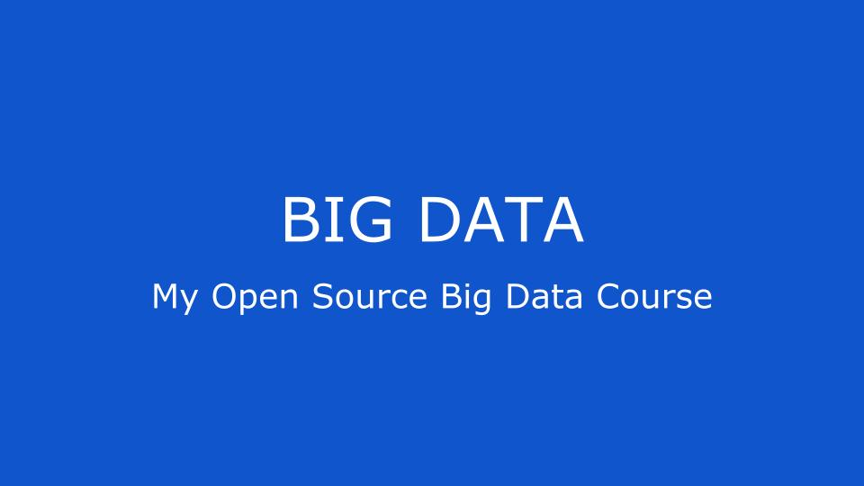

<!--   <a href="https://github.com/stefanluiken/my-open-source-cs"> -->
	
  </a>

## Content

- [Lectures](#lectures)

## Lectures
### Week 1
- [x] [First Steps With PySpark and Big Data Processing](https://github.com/najmabad/my-open-source-big-data-course/blob/main/first_steps_with_pyspark.md)
- [x] [A Brief Introduction to Distributed Computing with PySpark](https://github.com/najmabad/my-open-source-big-data-course/blob/main/brief_intro_to_distributed_computing_with_pyspark.md)
